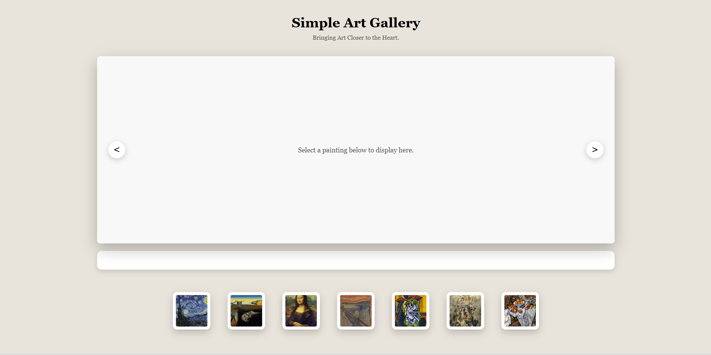

# Simple Art Gallery

A simple and elegant web-based art gallery built with **HTML, CSS, and JavaScript.**
This project allows users to preview famous paintings with smooth transitions and basic navigation controls.

## Features

- Image preview section with smooth fade transition

- Hover to display selected painting

- Keyboard accessibility (Enter / Space to select)

- Previous / Next navigation buttons

- Active thumbnail highlighting

- Dynamic image title display

- Basic accessibility support (ARIA attributes)

## Technologies Used

- **HTML5**

- **CSS3** (Flexbox, transitions, shadows)

- **JavaScript** (DOM manipulation, event handling)

## Learning Objectives

- Manipulate the DOM with JavaScript

- Handle user events (hover, click, keyboard)

- Create smooth transitions with CSS

- Improve basic accessibility

- Manage simple state in JavaScript

